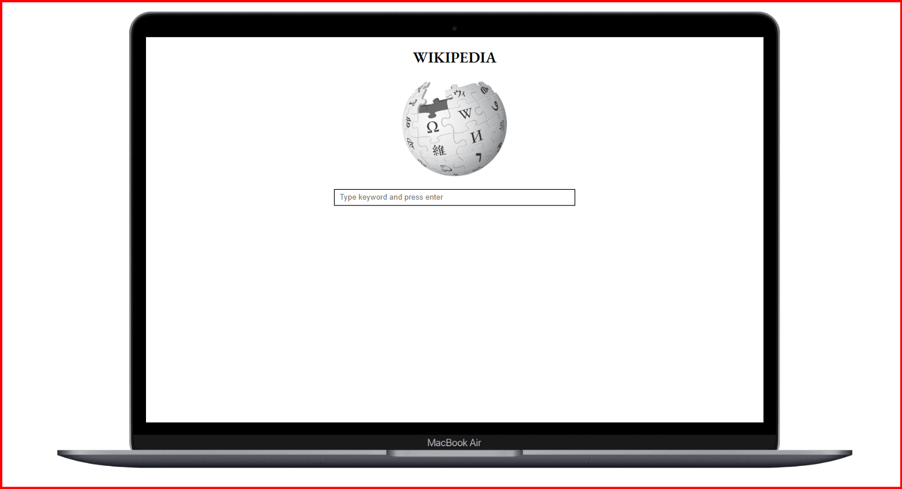
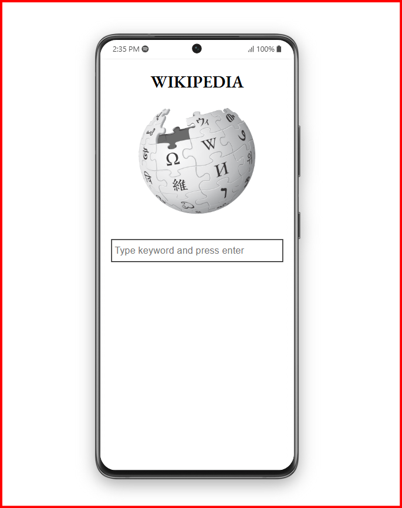

# 📚 Wikipedia Search Application

A simple and responsive web application that allows users to search Wikipedia articles dynamically using the Wikipedia API.

---

## 📋 Project Overview

This project allows users to search Wikipedia and see real-time results, including article titles, descriptions, and direct links — all fetched using the Wikipedia API.  
It's a beginner-friendly project demonstrating API integration, DOM manipulation, and responsive design.

---

## ✨ Features

- 🔎 Live Wikipedia article search
- 📄 Displays article title, short summary, and a link to the full Wikipedia page
- 📱 Fully responsive design (works on mobile, tablet, and desktop)
- ⚡ Built with HTML5, CSS3, and Vanilla JavaScript
- 🌐 Fetches live data using Fetch API with `async/await`

---

## 🖼️ Screenshots

### 💻 Desktop View

### 📱 Mobile View

---

## 🛠️ Technologies Used

- HTML5
- CSS3 (Flexbox, Media Queries)
- JavaScript (Vanilla JS, Fetch API)
- Wikipedia API

---

🌍 Live Demo
🔗 View Live Website (https://ankitkumaar01.github.io/Wikipedia_Search-Application/)

---

🙌 Author
Made with ❤️ by Ankit

